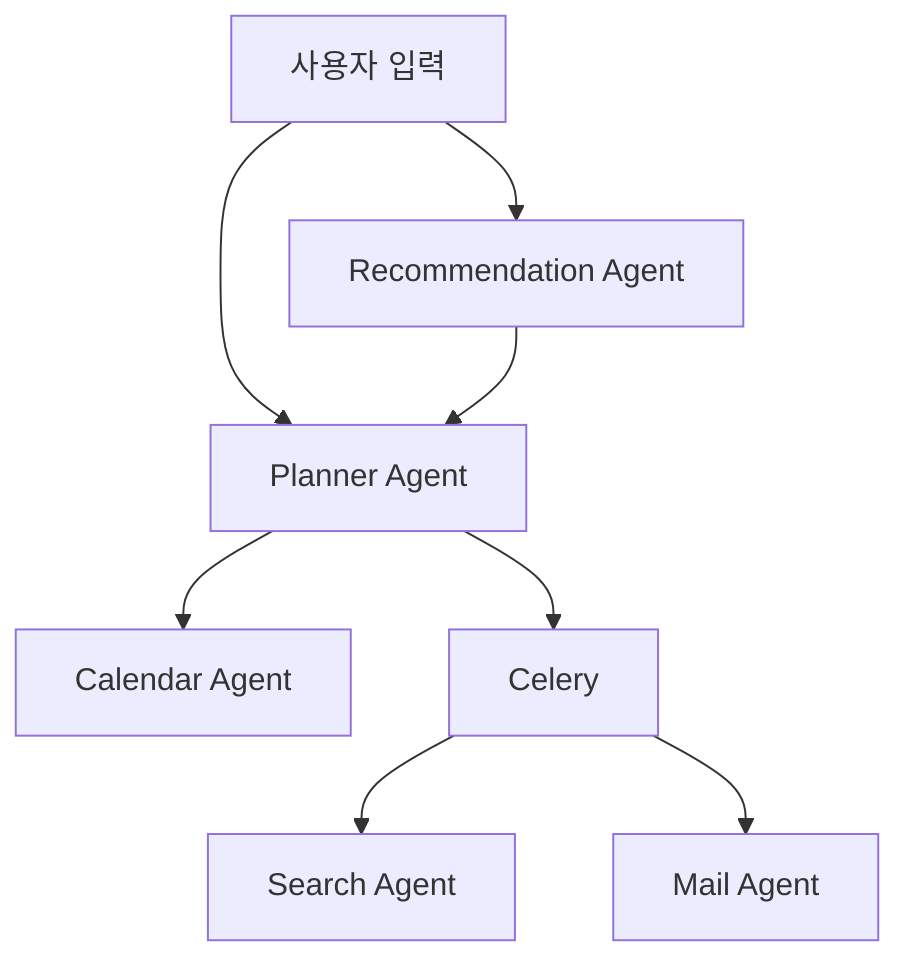
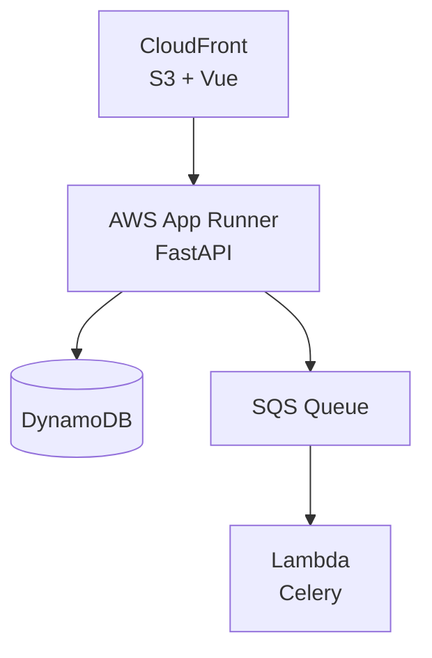

# Travel Agent

## Agent 구조

## Infra Architecture

- Vue로 정말 간단한 프론트를 빌드해 S3에 올려 CloudFront로 배포하였습니다.
- StreamResponse를 위해 AWS App Runner로 FastAPI를 배포하였습니다.
- 각종 context 저장을 위해 DynamoDB를 이용하였습니다.
- Search Agent가 naver API ratelimit 등 오래 걸려, 비동기 처리하였고 Celery Broker로 SQS를 이용하였습니다.
- Celery Worker로 Lambda를 이용하였습니다.
- 각 배포는 deploy.sh frontend/deploy.sh setup_lambda.sh 를 통해 할 수 있습니다.
- [주소](https://dm7qnuxu8ey5m.cloudfront.net)

## 개선할 점
- 다양한 LLM 모델들의 ModelConfig가 부족합니다.
- Agent Response Json 정규화가 많이 되지 않았습니다.
- 캘린더 등록 시 LLM을 이용한 작업이기보다는, 분기를 통한 작업으로 두었습니다.
- UI/UX적으로 부족합니다.
- email 전송 이후 Flow가 좀 어색합니다.
- pre-commit / github action 등 개발 편의, 협업 도구가 부족합니다.
- test code가 부족합니다.

## 시연 스크린샷

